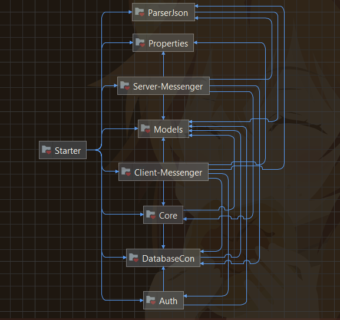
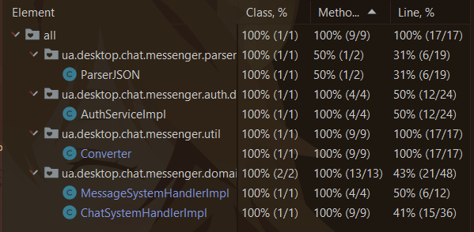
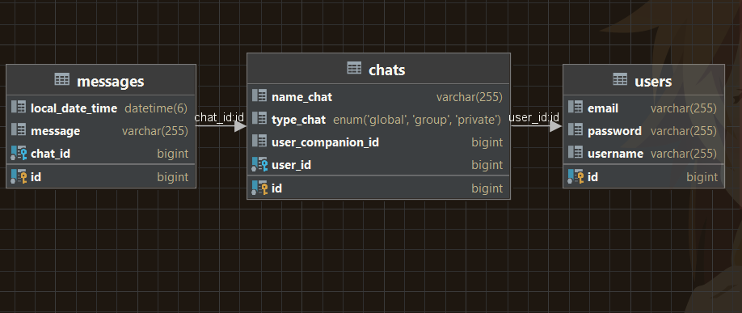

# Desktop Chat Messenger 👨‍💻👩‍💻


> This application is Client-Server java chat-messenger.
> The client-side & server-side have a GUI and client
> communicates with the server to send/receive messages
> to/from anyone clients respectively.

---

## List of Contents

- [Description](#description)
- [Technologies](#technologies)
- [Patterns](#patterns)
- [Project Structure](#project-structure)
- [Features](#features)
- [Usage](#usage)
- [Database](#database)
- [Diagram business logic](#diagram-business-logic)
- [Author Info](#author-info)

---

## Description

### Preview, I hope you enjoy it 😊

Welcome to Desktop-Chat-Messenger, a project designed to conversation between users with a user-friendly interface.
This project is built using Java 11, Hibernate 6, HikariCP, MySQL Driver, and Java Swing for the graphical user
interface.
All technologies you can see in the part of this README.md under the heading [Technologies](#technologies).

---

## Technologies

- `Thread Management`
- `Sockets`
- `JavaIO`
- `Swing`
- `Hibernate 6`
- `HikariCP`
- `MySQL Driver`
- `Log4j2`
- `bcprov-jdk15on` (P.S. this is cryptography library. About using described below.)
- `JUnit 5`
- `guava` (P.S. this is open-source Java library developed by Google. About using described below.)
- `gson` (P.S. this is library developed by Google for working with JSON. About using described below.)


## Patterns
- `Observer` - The pattern is a behavioral design pattern that is used when an object, known as the subject, maintains a list of its dependents, called observers, and notifies them of state changes, typically by calling one of their methods.
---

## Project Structure

- The application consists of 9 modules and each module is divided into ui, domain, dao layers.
- An app modules:
    - `Auth`: This module is responsible for authentication-related functionality, including user registration and
      login;
    - `Client-Messenger`: The "Client-Messenger" module is primarily focused on the client-side implementation of a
      messenger application.
      It handles user interactions, message sending and receiving, and user interface components for the client
      application;
    - `Core`: The "Core" module serves as the heart of the application, containing essential core functionalities that
      are shared among various parts of the project.
      It often includes utility classes, common business logic, and other essential components.
      Сan be used both `Client-Messenger` and `Server-Messenger`;
    - `DatabaseCon`: This module manages the database connectivity for the application. It handles database
      interactions, connection pooling, and database-related configurations;
    - `Models`: The "Models" module is responsible for defining the data models and entities used throughout the
      application. It includes classes that represent database tables, DTOs (Data Transfer Objects), and other data
      structures like enum etc.;
    - `ParserJSON`: This module deals with JSON (JavaScript Object Notation) parsing and serialization/deserialization.
      It's responsible for converting Java objects to JSON and vice versa, facilitating data exchange in JSON format;
    - `Properties`: The module contains a class that is responsible for reading property files;
    - `Server-Messenger`: This module focuses on the server-side implementation of the messenger application. It handles
      incoming client connections, message handling, and server-specific functionality;
    - `Starter`: The "Starter" module serves as the entry point for the application. This module contains classes for
      starting work with server and clients.

### Diagram modules application

- The modules diagram:<br>
  

### User Interface

- The user interface is built using the `Swing` library, providing an intuitive and interactive access.

### Database

- The project utilizes `MySQL` to store and manage information.

### Security

- User password information are encrypted using `SHA3-256` for enhanced security.

### Extensibility

- The system is designed to be extensible, allowing for the addition of new features and improvements in the
  future.

### Testing

- The system is partially tested using `JUnit 5` to ensure its functionality and reliability. Modules that was
  tested: `Auth`, `Core`, `ParserJSON`, and class `Converter` into `Models` module.

- The testing result:<br>
  

### Logging

- Log4j2 is employed to provide logging (levels: `info`, `warn`, `error`).

### Dependencies

- The project uses several external dependencies to enhance its functionality, including:
    - `Hibernate`: It simplifies database interaction by mapping Java objects to database tables, allowing you to work
      with databases using Java objects
    - `HikariCP`: When used together, HikariCP and Hibernate provide efficient database connection management and data
      persistence capabilities.
      HikariCP provides a highly efficient and lightweight connection pooling mechanism.
      Instead of creating a new database connection for every database interaction and closing it afterward, HikariCP
      maintains a pool of pre-established connections that can be reused.
    - `Log4j2`: Log4j2 is a widely used logging framework for Java applications.
    - `bcprov-jdk15on`: Bouncy Castle Provider (bcprov-jdk15on) is a cryptography library for Java. I use it for
      auth/register user (encryption password).
    - `guava`: Guava is an open-source Java library developed by Google. It provides a collection of utility classes and
      functions that simplify common programming tasks. In app I use MultiMap, it's so comfortable to use and u don't
      need to write this code yourself.
    - `gson`: It allows you to serialize Java objects into JSON format and deserialize JSON data into Java objects.
    - `MySQL Driver`: It provides the necessary functionality to establish database connections, execute SQL queries,
      and retrieve results from MySQL databases. Its implementation methods JDBC API.

---

## Features

- ✅️ Auth in app:
    - ✅️ Authorization;
    - ✅️ Registration;
      <br><br>
- ✅️ Client:
    - ✅ ️ Close Client;
    - ✅️ Create chat (Group);
    - ✅️ Invite into chat (By name chat);
    - ✅️ Send/receive messages in real time;
    - ✅️ Type chats into app:
        - GLOBAL;
        - GROUP;
        - PRIVATE;
    - ✅️ Show history chats (Click on chat);
      <br><br>
- ✅️ Server:
    - ✅ Close Server;
    - ✅️ Show logs;
---

## Usage

1. I recommended u to clone my project from the GitHub.
   <br> If u wanna do this please use this command:

```md  
git clone https://github.com/dima666Sik/Get-takes-up-size-of-Java-objects-in-memory.git
```

2. To run this project you will need to install:
    - JDK 11 or higher;
    - MySQL RDBMS.

3. If you have downloaded a project and want to run it with your own database then you have to change .properties file which will be
   stored in a module `DatabaseCon` in this way `src/main/java/resouces/hibernate.properties` and put your valid data please.

```properties
# Configuration (Data source)
hibernate.driver_class=com.mysql.cj.jdbc.Driver
# Origin database
hibernate.connection.url=jdbc:<rdbms>://<domain>:<port>/<nameDB>
# Test database
# hibernate.connection.url=jdbc:<rdbms>://<domain>:<port>/<testNameDB>
hibernate.connection.username=<username>
hibernate.connection.password=<password>

hibernate.connection.provider_class=org.hibernate.hikaricp.internal.HikariCPConnectionProvider
# Minimum number of ideal connections in the pool
hibernate.hikari.minimumIdle=5
# Maximum number of actual connection in the pool
hibernate.hikari.maximumPoolSize=10
hibernate.hikari.idleTimeout=30000
# Maximum waiting time for a connection from the pool (20.s)
hibernate.hikari.connectionTimeout=20000

# Configuration (Hibernate)
hibernate.dialect=org.hibernate.dialect.MySQLDialect
hibernate.show_sql=true
hibernate.current_session_context_class=thread
hibernate.hbm2ddl.auto=update
```
4. Here are the steps for you to follow:
    - Add this project to your IDE as `Maven` project.
    - If necessary, configure `Java SDK 11` in `Project Structure settings`.
    - You can change setting to your logging into `log4j2.properties`.
    - First, you will need to register as a new user.

---

## Database

- You need to create database and add properties to `hibernate.properties`, and this all that u must to do in order to start
  to using this project.
  <br><i><b>Visually it looks like this:</b></i><br>
  

---

## Author Info

- [Linkedin](https://www.linkedin.com)

- [GitHub](https://github.com/dima666Sik)

[Back To The Top](#chatbot-game-v2)